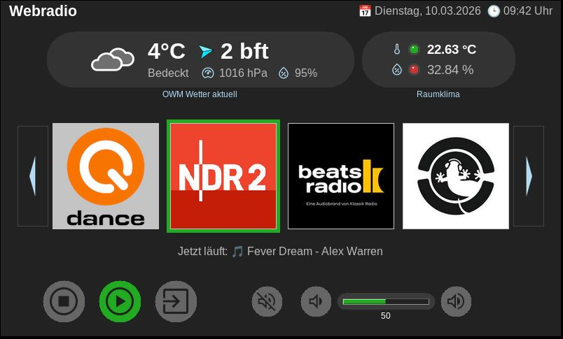

# Webradio GUI für Raspberry Pi

Eine moderne Webradio-Oberfläche in **Python/Tkinter** mit Anzeige von Wetter, Raumklima, Senderliste und Player-Steuerung.
Das Projekt ist für den Raspberry Pi mit offiziellem 7"-Touchscreen Display optimiert, läuft aber auch auf anderen Linux-Systemen.
Ggf. müssen dann allerdings noch Anpassungen vorgenommen werden.

-----

## Inhaltsverzeichnis

- [Features](#features)
- [Voraussetzungen](#voraussetzungen)
- [Installation](#installation)
- [Konfiguration](#konfiguration)
- [DesktopIcon](#desktopicon)
- [Start](#start)
- [Ordnerstruktur](#ordnerstruktur)
- [Screenshot](#screenshot)
- [Lizenz](#lizenz)
- [Autor](#autor)

-----

## Features

- Anzeige von aktuellen Wetterdaten (OpenWeatherMap)  
- Raumklimaanzeige mit Temperatur & Luftfeuchtigkeit  
- Farbige LEDs mit realistischem Glow-Effekt  
- Senderliste mit Pfeilnavigation  
- Player-Steuerung: Play, Stop, Exit, Lautstärke, Mute, Lautstärke-Balken  
- Vollständig in **Tkinter** umgesetzt  
- Modularer Aufbau für zukünftige Erweiterungen  

-----

## Voraussetzungen

- Raspberry Pi oder Linux-System  
- Python 3.7+  
- Zugang zu OpenWeatherMap (API-Key) für Wetterdaten

-----

## Installation

Repository klonen:

- git clone https://github.com/mare-media-com/webradio.git
- cd webradio

Abhängigkeiten installieren:

- pip install -r requirements.txt

-----

## Konfiguration

- .envexample umbenennen in .env und anpassen:
- OWM_KEY = YOUR_OWM_KEY                      # (erstellen unter https://openweathermap.org/)
- WEATHER_LAT = YOUR_LATITUDE                 # (z.B. 54.80797555)
- WEATHER_LON = YOUR_LONGITUDE                # (z.B. 9.52438474)
- WEATHER_EXCL = minutely,hourly,daily,alerts # (siehe OWM documentation)

- MQTT_HOST = YOUR_MQTT_IP                    # (z.B. 192.168.178.10)
- MQTT_PORT = YOUR_MQTT_PORT                  # (z.B. 9001 for websocket)
- TEMP_TOPIC = YOUR_TEMPERATURE_TOPIC         # (z.B. esp32/bme280/temperature)
- HUMI_TOPIC = YOUR_HUMIDITY_TOPIC            # (z.B. esp32/bme280/humidity)

- ggf. Senderliste in stations = {} anpassen

-----

## DesktopIcon:

- /img/webradio.png

```
Datei:
webradio.desktop in /home/<user>/Desktop

Inhalt:
[Desktop Entry]
Type=Application
Name=WebRadio
Comment=Raspberry Pi WebRadio
Exec=python3 /home/<user>/webradio/webradio_advanced.py
Path=/home/<user>/webradio
Icon=/home/<user>/webradio/img/webradio.png
Encoding=UTF-8
Terminal=false
Categories=Audio;
Name[de_DE]=WebRadio
```

-----

## Start:

- python3 webradio_advanced.py

Für Autostart nach Boot:
cp ~/Desktop/webradio.desktop ~/.config/autostart/

-----

## Ordnerstruktur

```
webradio/
├── webradio_advanced.py	# Hauptskript
├── img/					# Icons als PNGs
│   ├── thermometer.png
│   ├── play.png
│   ├── beatsradio.png
│   └── ... weitere Symbole, Steuerungs- und Sender-Icons
│   └── weather_icons/
│   	└── 01d.png
│   	└── orkan.png
│   	└── ... weitere Wetter-Icons
├── README.md
└── requirements.txt		# Python-Abhängigkeiten
└── .env       				# individuelle Umgebungsvariablen
└── .envexample       		# Kopiervorlage
└── last_station.txt     	# (leere) Textdatei zum Speichern des zuletzt gespielten Senders
```

-----

## Screenshot



-----

## Lizenz

Dieses Projekt steht unter der MIT-Lizenz. Du darfst den Code frei verwenden, kopieren und anpassen.

-----

## Autor

Projekt erstellt von **codewerkstatt @ mare-media.com**
